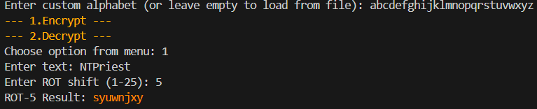
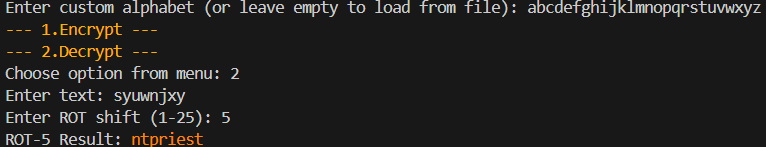
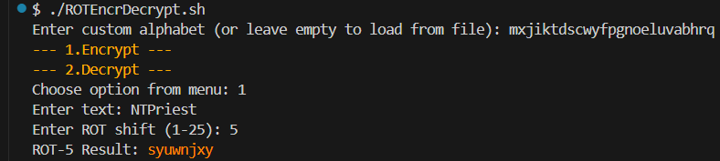
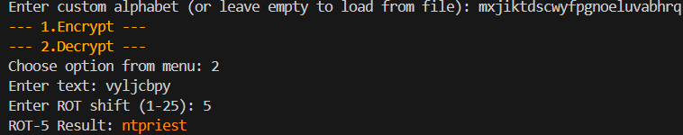

# HyperROT
A ROT (1-25) encryption/decryption script in Bash, designed for offline use. Users can customize the alphabet (seed) by defining their own, either directly in the console or by loading it from a text file.

This script is highly secure for short encrypted words, but longer phrases can be broken using statistical decryption methods. Additionally, it does not encrypt special characters or letters, leaving them unchanged.
## 1. Run:
```chmod +x HyperROT.sh```

```sudo ./HyperROT```

## 2. Usage:

### 2.1. Encrypted/Decrypted by user value:




### With different Alphabet:




### Using file with alphabet in it:
To load the ```alphabet.txt``` file, simply leave the input blank (just press Enter). 
 However, the file must be named "alphabet.txt" and located in the same folder as the script.

## License:
This project is licensed under the [Creative Commons Attribution-NonCommercial 4.0 International (CC BY-NC 4.0)](LICENSE.txt).  
You are free to share and adapt the material, but only for non-commercial purposes and with proper attribution.  
